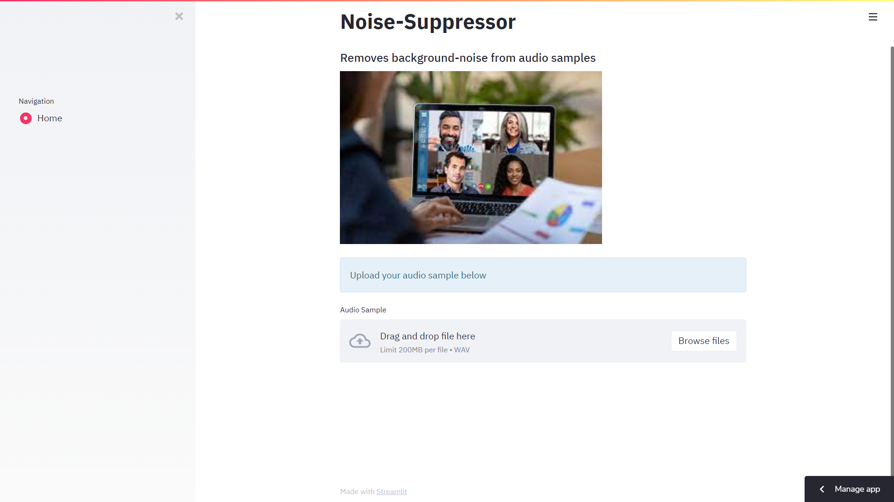

# Noise Suppression Using Deep Learning

## 📌 Project Overview
In the era of online meetings and remote work, background noise can significantly disrupt communication. This project focuses on building a **deep learning model** to suppress background noise in audio recordings, making it ideal for online meetings, remote work, and virtual classrooms. The model uses **Convolutional Autoencoders** to separate noise from clean audio signals.

---

## Understanding The Problem Statement
With the rise of online meetings, virtual classrooms, and work-from-home culture due to the COVID-19 pandemic, background noise has become a major hindrance to effective communication. Factors like domestic environments and lack of professional setups often introduce unwanted background noise, disrupting workflows. This project aims to address this issue by developing a robust system to suppress **"STUPID BACKGROUND NOISE"** and provide clean, noise-free audio for seamless communication.

---

## 🛠️ Tools 
- **TensorFlow** : For building and training the deep learning model.
- **Convolutional Autoencoders** : The core architecture for noise suppression.
- **Main Libraries**:
  - `IPython`  (for audio playback)
  - `Pickle` 
---

## Model Architecture
The model is built using **Convolutional Autoencoders**, which are trained to detect and remove unwanted noise from audio samples. The architecture consists of:
1. **Encoder**: A series of convolutional layers to extract noise features from the input audio.
2. **Decoder**: A series of transposed convolutional layers to reconstruct the clean audio signal.
3. **Loss Function**: **Huber Loss** is used to train the model, ensuring robust performance even with noisy data.

---

## Prototype Insights
Below are some visualizations of the model's performance:

---
